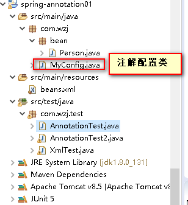

# @Configuration&@Bean给容器中注册组件



## 一、xml方式

### 1.1、写一个spring的配置文件

```xml
	<!--
		如果不指定id,容器会为它分配一个id,但绝不是类名首字母小写
		通过ioc的 getBeanDefinitionNames方法,看到了分配的名字
		是com.wzj.bean.Person#0 
	 -->
	<bean id="person" class="com.wzj.bean.Person">
		<property name="name" value="wzj"></property>
		<property name="age" value="22"></property>
	</bean>
```


### 1.2、然后测试

```java
public class XmlTest {
	public static void main(String[] args) {
		ClassPathXmlApplicationContext ioc = new ClassPathXmlApplicationContext("beans.xml");
		//这是获取容器中所有的bean名称
		String[] names = ioc.getBeanDefinitionNames();
		for (String name : names) {
			System.out.println(name);
		}
		//ioc.getBeanNamesForType(Person.class); 这是获取指定类型的Bean名称 
		Person person = (Person) ioc.getBean("person");
		System.out.println(person);
	}
}
```

### 1.3、控制台输出

```java
person  //这是查看容器中的名字
Person [name=wzj, age=22]
```


## 二、注解方式

### 2.1、写一个配置类(对应之前的配置文件)

```java
//告诉spring这是一个配置类,配置类==配置文件
@Configuration
public class MyConfig {

	/*
	 	向ioc容器中注入一个bean,
	 	bean的类型是方法返回值的类型,
	 	bean的id默认为方法名, 也可以通过 @Bean里面的value属性修改
	 */
	@Bean(value="person")
	public Person person1() {
		return new Person("wzj",22);
	}
}
```


### 2.2、测试

- **方式一：**

  ```java
  /*
  	为了和xml方式形成鲜明的对比, 特意没用spring-test方式
   */
  public class AnnotationTest2 {
  	public static void main(String[] args) {
  		AnnotationConfigApplicationContext ioc = new AnnotationConfigApplicationContext(MyConfig.class);
  		String[] names = ioc.getBeanDefinitionNames();
  		for (String name : names) {
  			System.out.println(name);
  		}
  		System.out.println();
  		
  		Person person = (Person) ioc.getBean("person");
  		System.out.println(person);
  	}
  }
  ```

- **方式二：结合spring-test**

  ```java
  /*
  	@ContextConfiguration 该注解里面的属性
  	String[] locations() 一看就是xml方式
  	Class<?>[] classes() 一看就是注解方式
   */
  @RunWith(SpringJUnit4ClassRunner.class)
  @ContextConfiguration(classes= {MyConfig.class})
  public class AnnotationTest {
  	
  	@Autowired
  	private ApplicationContext ioc;
  	
  	@Test
  	public void test01() {
  		String[] names = ioc.getBeanDefinitionNames();
  		for (String name : names) {
  			System.out.println(name);
  		}
  		System.out.println();
  		
  		//根据方法名获取
  //		Person bean = (Person) ioc.getBean("person1");
  		//根据指定的名字获取
  		Person bean = (Person) ioc.getBean("person");
  		System.out.println(bean);
  	}
  }
  ```

  ### 2.3、控制台输出

  ```java
  org.springframework.context.annotation.internalConfigurationAnnotationProcessor
  org.springframework.context.annotation.internalAutowiredAnnotationProcessor
  org.springframework.context.annotation.internalRequiredAnnotationProcessor
  org.springframework.context.annotation.internalCommonAnnotationProcessor
  org.springframework.context.event.internalEventListenerProcessor
  org.springframework.context.event.internalEventListenerFactory
  myConfig -- 因为@Configuratin注解里面也是@Conpoent
  person
  
  Person [name=wzj, age=22]
  
  ```

  **唯一不同的是注解方式创建容器时, 会自动引入一些其他的bean组件**

