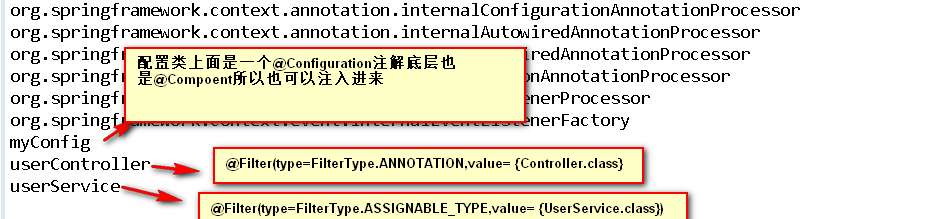

#  @ComponentScan-自动扫描组件&指定扫描规则

##  一 、xml方式

###  1.1、xml配置文件 

```xml
   <!--	
		use-default-filters="false" 表示禁用默认规则
		默认规则是扫描@Controller,@Service,@Repository,@Compoent  
		
		注意:只有禁用掉默认规则只包含(includeFilters)才能生效 
	-->
	<context:component-scan base-package="com.wzj" use-default-filters="false">
		<context:include-filter type="annotation" expression="org.springframework.stereotype.Controller"/>
	</context:component-scan>
```

### 1.2、测试

```java
public class XmlTest {
	public static void main(String[] args) {
		ClassPathXmlApplicationContext ioc = new ClassPathXmlApplicationContext("beans.xml");
		//这是获取容器中所有的bean名称
		String[] names = ioc.getBeanDefinitionNames();
		for (String name : names) {
			System.out.println(name);
		}
	}
}
```

### 1.3、控制台输出


## 二、注解方式

### 2.1、配置类

```java
/*
	@ComponentScan-自动扫描组件&指定扫描规则
	注意点:
		1. 使用 includeFilters 的时候一定要带上,useDefaultFilters=false
 */

//@ComponentScan value:指定要扫描的包
//excluderFilters = Filter[] : 指定扫描的时候按照什么规则排除那些组件
//includeFilters = Filter[] :  指定扫描的时候只需包含哪些组件 【注意:只有禁用掉默认规则只包含(includeFilters)才能生效】
/*
	FilterType.ANNOTATION: 按照注解
	FilterType.ASSIGNABLE_TYPE: 按照给定的类型
	FilterType.CUSTOM: 自定义包含规则
	----下面的了解----
	FilterType.ASPECTJ: 使用ASPECTJ表达式
	FilterType.REGEX: 使用正则
*/
//如果是jdk8,可以使用重复的@CompoentScan,因为里面有个@Repeatable,不是的话可以使用@ComponentScans包含@Component,我这里就不演示了
@Configuration
@ComponentScan(basePackages= {"com.wzj"},includeFilters= {
		@Filter(type=FilterType.ANNOTATION,value= {Controller.class}),
		@Filter(type=FilterType.ASSIGNABLE_TYPE,value= {UserService.class}),
		@Filter(type=FilterType.CUSTOM,value= {MyFilterType.class})
},useDefaultFilters=false)
public class MyConfig {

}
```

### 2.2、测试

```java
/*
	为了和xml方式形成鲜明的对比, 特意没用spring-test方式
 */
public class AnnotationTest {
	public static void main(String[] args) {
		AnnotationConfigApplicationContext ioc = new AnnotationConfigApplicationContext(MyConfig.class);
		//获取容器中bean的名字
		String[] names = ioc.getBeanDefinitionNames();
		for (String name : names) {
			System.out.println(name);
		}
	}
}
```

### 2.3、控制台输出

