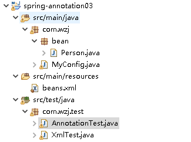

# @Scope组件作用域 和 @Lazy 懒加载




##  一、xml方式

###  1.1、配置文件

```xml
	<!--
		组件的作用域默认就是 scope = singleton 的时候
		容器一创建就会去初始化(通过构造器去看,不要通过getBeanDefinitionNames()去看)
		
		那可不可以也让他调用方法获取对象的时候才创建对象?
		懒加载: 容器启动时不创建对象, 第一次获取bean的时候,创建并初始化(只针对singleton)
		答案是可以: 使用懒加载: lazy-init="true"
	  -->
	<bean id="person" class="com.wzj.bean.Person" scope="singleton" lazy-init="true">
	
	</bean>
```


###  1.2、测试

```java
public class XmlTest {
	public static void main(String[] args) {
		ClassPathXmlApplicationContext ioc = new ClassPathXmlApplicationContext("beans.xml");
		
		
		//如果该bean的scope是单例的,默认容器创建时就会初始化对象,两次拿到的对象是同一个
		//如果该bean的scope是prototype的,创建容器时不会去初始化对象,只有每次获取的时候才会调用方法创建对象,两次拿到的对象不是同一个
//		Person p1 = (Person) ioc.getBean("person");
//		Person p2 = (Person) ioc.getBean("person");
//		System.out.println(p1 == p2);
	}
}
```


##  二、注解方式

###  2.1、配置类

```java
@Configuration
public class MyConfig {
	
	/*
		bean的组件作用域默认就是单例,容器创建时就初始化对象,如果想获取的时候才会调用方法创建对象可以使用懒加载@Lazy
		如果使用prototype时,创建容器时不会去初始化对象,只有每次获取的时候才会调用方法创建对象,两次取出来的对象不是同一个!
	 */
	@Scope("prototype")
	@Bean("person")
	public Person person() {
		return new Person();
	}
}
```


###  2.2、测试

```java
public class AnnotationTest {
	public static void main(String[] args) {
		AnnotationConfigApplicationContext ioc = new AnnotationConfigApplicationContext(MyConfig.class);
		ioc.getBean("person");
	}
}
```


