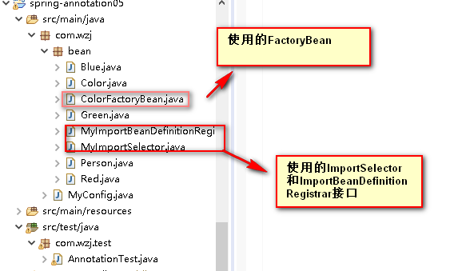
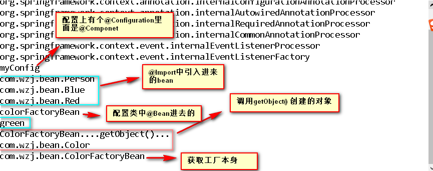

# 給容器中注册组件之@import



##  一、配置类

```java
@Configuration
@Import({Person.class,MyImportSelector.class,MyImportBeanDefinitionRegistrar.class})
public class MyConfig {
	
	/**
 		給容器中注册组件:
	 	1. 包扫描+组件标注注解(@Controller/@Service/@Repository/@Component)
	 	2. @Bean[导入第三方包里面的组件]
	 	3. @Import[快速給容器中导入一个组件],点击进入,该注解上面的注释为我们提供的方式!!!
	 		a. @Import(要导入到容器的组件), 容器会自动注册这个组件,id默认是全类名 
	 		b. ImportSelector接口: 返回需要导入的组件的全类名数组 [springBoot源码分析的时候,采用这种比较多]
	 		c. ImportBeanDefinitionRegistrar接口: 手动注册bean到容器中
   */
}
```
##  二、测试

```java
public class AnnotationTest {
	public static void main(String[] args) {
		AnnotationConfigApplicationContext ioc = new AnnotationConfigApplicationContext(MyConfig.class);
		
		//获取容器中的名字
		String[] names = ioc.getBeanDefinitionNames();
		for (String name : names) {
			System.out.println(name);
		}
	}
}
```

## 三、控制台输出

